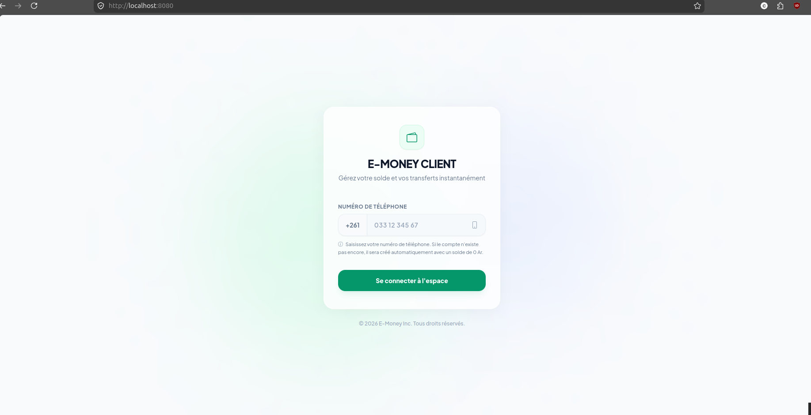
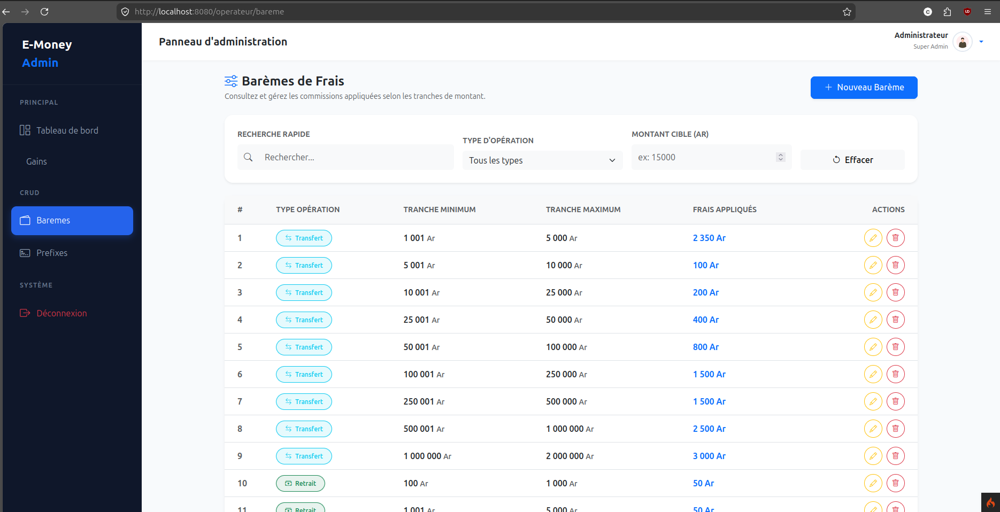
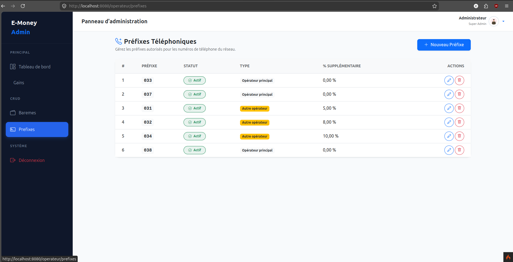
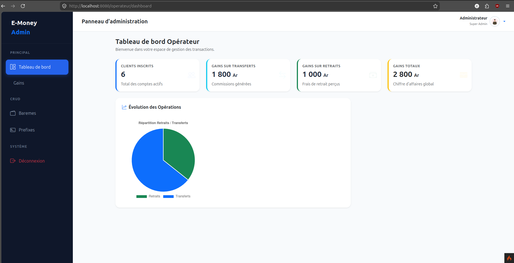
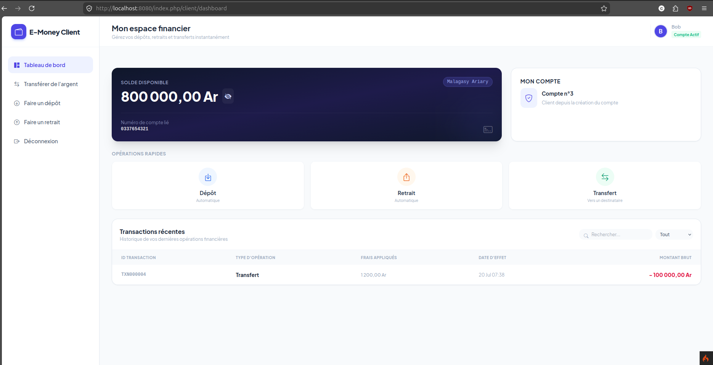
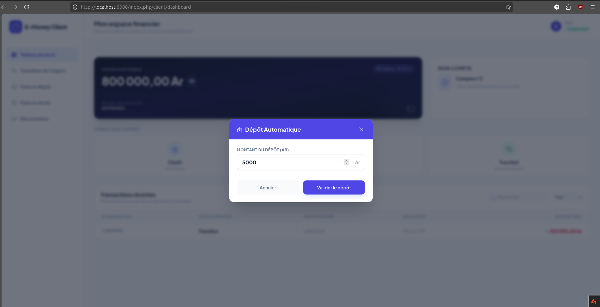

# Operateur Mobile App


Operateur Mobile App est une application web développée avec PHP et CodeIgniter 4 pour gérer les opérations d’un opérateur mobile. Elle permet de traiter les transactions liées aux dépôts, retraits, transferts et de suivre les gains générés par les frais applicables.

## 🚀 Objectif du projet

L’objectif principal de cette application est de fournir une plateforme interne simple et efficace pour superviser les opérations financières d’un opérateur mobile, gérer les commissions et suivre les activités de transfert et de retrait.

## ✨ Fonctionnalités principales

- Gestion des opérations de dépôt et de retrait
- Traitement des transferts entre clients
- Suivi des gains générés par les frais de transaction
- Affichage des statistiques liées aux opérations opérateur
- Gestion des barèmes et préfixes associés aux transferts
- Interface administrateur dédiée à l’exploitation des données

## 🛠️ Technologies utilisées

- PHP 8.2
- CodeIgniter 4
- MySQL / SQLite
- HTML5 / CSS3 / Bootstrap
- Composer
- PHPUnit

## ⚙️ Installation

### Prérequis

- PHP 8.2 ou supérieur
- Composer
- Base de données MySQL ou SQLite
- Extension PHP compatible avec CodeIgniter 4

### Étapes d’installation

1. Cloner le dépôt :
   ```bash
   git clone https://github.com/Candretseheno11/Operateur.git
  
   ```

2. Installer les dépendances PHP :
   ```bash
   composer install
   ```

3. Copier le fichier d’environnement :
   ```bash
   cp env .env
   ```

4. Configurer la base de données dans le fichier .env :
   ```env
   app.baseURL = 'http://localhost:8080'

   database.default.hostname = 'localhost'
   database.default.database = 'mobilemoney.db'
   database.default.username = 'root'
   database.default.password = ''
   database.default.DBDriver = 'MySQLi'
   ```

5. Importer la structure de la base de données si nécessaire.

6. Démarrer l’application :
   ```bash
   php spark serve
   ```

L’application sera accessible à l’adresse : http://localhost:8080

## ▶️ Utilisation

Une fois le serveur lancé, vous pouvez :

- consulter les opérations réalisées,
- gérer les transferts et retraits,
- analyser les gains générés,
- administrer les paramètres liés aux frais et préfixes.

## 📁 Structure du projet

```text
Regime/
├── app/
│   ├── Controllers/
│   ├── Models/
│   ├── Views/
│   ├── Database/
│   └── Config/
├── public/
├── system/
├── tests/
├── writable/
└── composer.json
```

## 📸 Captures d’écran

- Page d’accueil et authentification : 

- Tableau de bord opérateur : 





- Gestion des opérations et gains : à venir




## 🔮 Améliorations futures

- Ajout de tableaux de bord plus détaillés
- Amélioration de l’interface utilisateur
- Intégration d’alertes et notifications en temps réel
- Ajout de logs et suivi avancé des transactions
- Déploiement sur un environnement cloud

## 👤 Auteur

Christon

## 📄 Licence

Ce projet est sous licence MIT. Voir le fichier LICENSE pour plus de détails.
